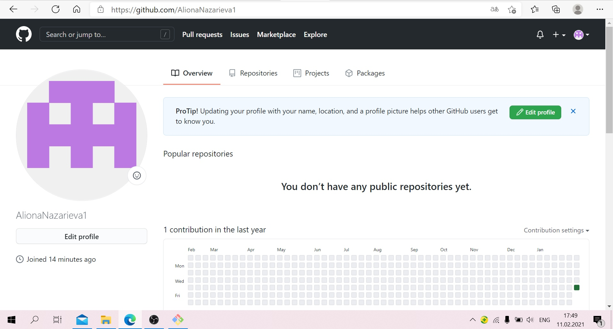
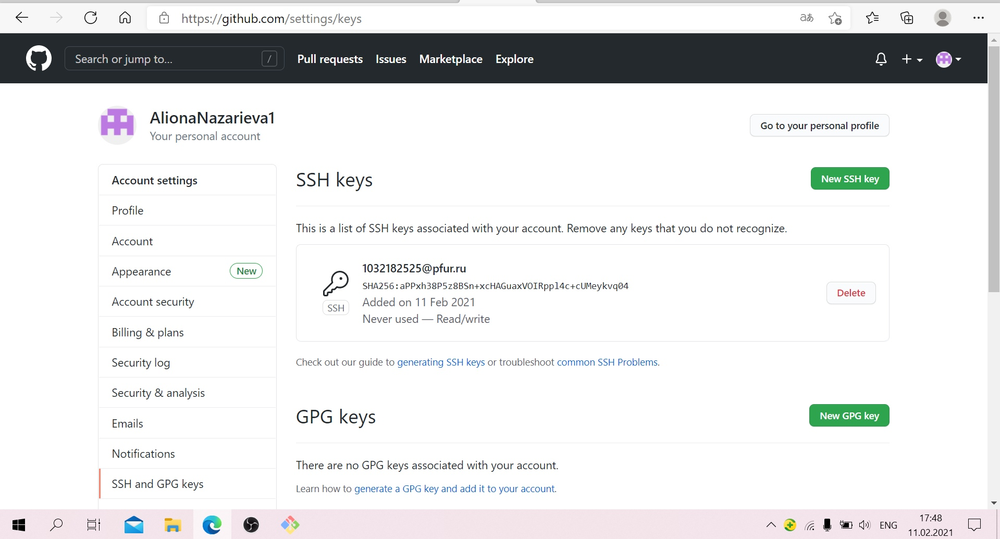
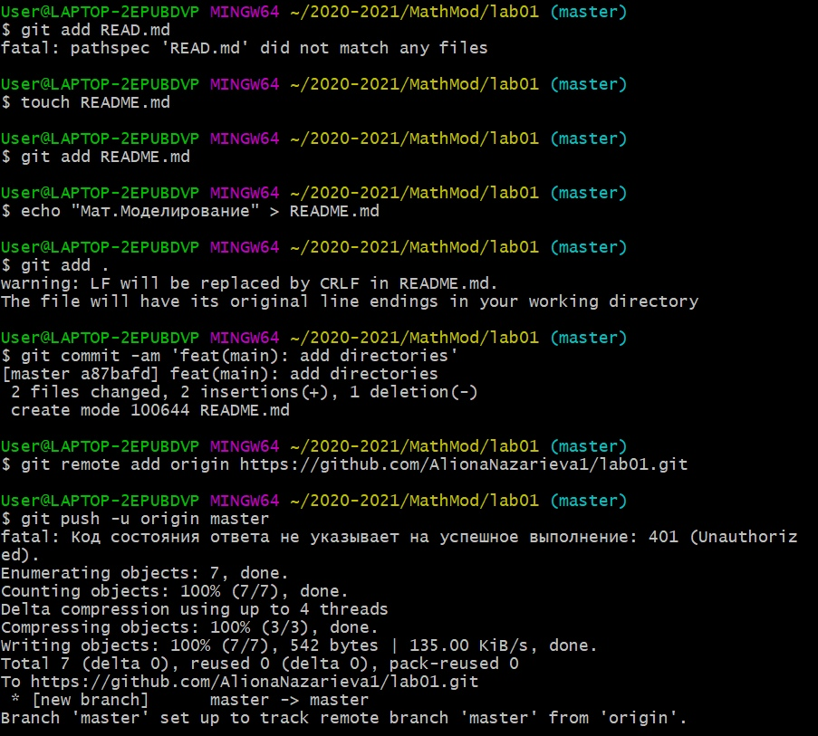
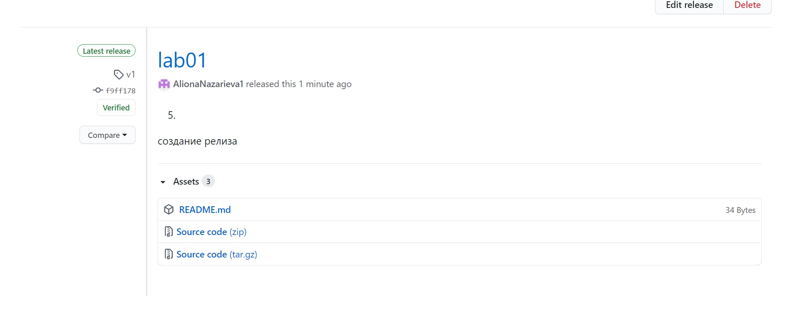

---
## Front matter
lang: ru-RU
title: Работа с Git
author: |Назарьева Алена НФИбд-03-18
institute: |
	\inst{1}RUDN University, Moscow, Russian Federation
date: 2021, 13 february
## Formatting
toc: false
slide_level: 2
theme: metropolis
header-includes:
 - \metroset{progressbar=frametitle,sectionpage=progressbar,numbering=fraction}
 - '\makeatletter'
 - '\beamer@ignorenonframefalse'
 - '\makeatother'
aspectratio: 43
section-titles: true
---
# Цель работы

Цель данной лабораторной работы --- познакомиться с основными возможностями программы Git, а также разметки Markdown и платформы GitHub.

# Выполнение лабораторной работы
## 1)
Создание логина на GitHub (рис. -@fig:001)

{ #fig:001 width=70% }

## 2)
Загрузка ssh ключей на него (рис. -@fig:002)

{ #fig:002 width=70% }

## 3)
Создание и загрузка каталогов, Правильный формат коммитов (рис. -@fig:003)

{ #fig:004 width=70% }

## 5)
Создание релиза на GitHub

{ #fig:006 width=70% }

# Выводы

В результате проделанной работы я познакомилась с возможностями Git и Markdown
