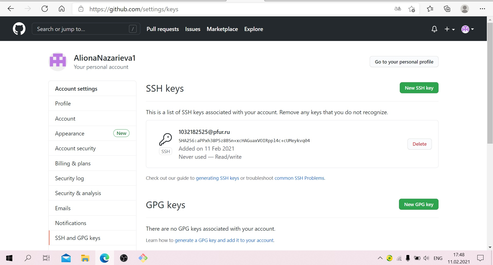
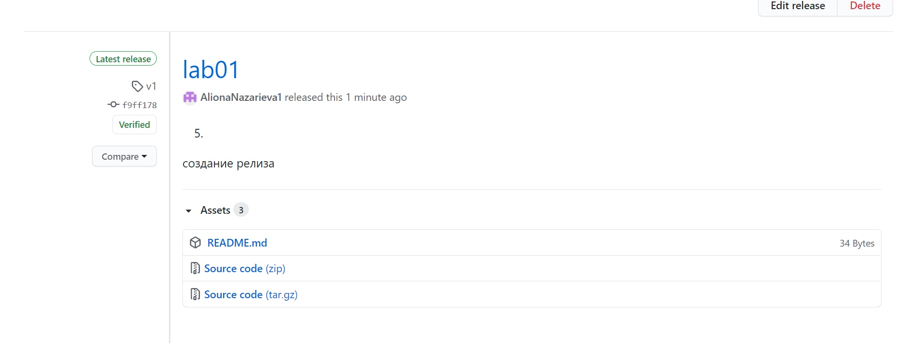

---
# Front matter
lang: ru-RU
title: "Oтчёт по лабораторной работе"
subtitle: "Работа с Git"
author: "Назарьева Алена Игоревна НФИбд-03-18"

# Formatting
toc-title: "Содержание"
toc: true # Table of contents
toc_depth: 2
lof: true # List of figures
lot: true # List of tables
fontsize: 12pt
linestretch: 1.5
papersize: a4paper
documentclass: scrreprt
polyglossia-lang: russian
polyglossia-otherlangs: english
mainfont: PT Serif
romanfont: PT Serif
sansfont: PT Sans
monofont: PT Mono
mainfontoptions: Ligatures=TeX
romanfontoptions: Ligatures=TeX
sansfontoptions: Ligatures=TeX,Scale=MatchLowercase
monofontoptions: Scale=MatchLowercase
indent: true
pdf-engine: lualatex
header-includes:
  - \linepenalty=10 # the penalty added to the badness of each line within a paragraph (no associated penalty node) Increasing the value makes tex try to have fewer lines in the paragraph.
  - \interlinepenalty=0 # value of the penalty (node) added after each line of a paragraph.
  - \hyphenpenalty=50 # the penalty for line breaking at an automatically inserted hyphen
  - \exhyphenpenalty=50 # the penalty for line breaking at an explicit hyphen
  - \binoppenalty=700 # the penalty for breaking a line at a binary operator
  - \relpenalty=500 # the penalty for breaking a line at a relation
  - \clubpenalty=150 # extra penalty for breaking after first line of a paragraph
  - \widowpenalty=150 # extra penalty for breaking before last line of a paragraph
  - \displaywidowpenalty=50 # extra penalty for breaking before last line before a display math
  - \brokenpenalty=100 # extra penalty for page breaking after a hyphenated line
  - \predisplaypenalty=10000 # penalty for breaking before a display
  - \postdisplaypenalty=0 # penalty for breaking after a display
  - \floatingpenalty = 20000 # penalty for splitting an insertion (can only be split footnote in standard LaTeX)
  - \raggedbottom # or \flushbottom
  - \usepackage{float} # keep figures where there are in the text
  - \floatplacement{figure}{H} # keep figures where there are in the text
---

# Цель работы

Цель данной лабораторной работы --- познакомиться с основными возможностями программы Git, а также разметки Markdown и платформы GitHub.

# Задание

1) Создание логина на GitHub
2) Загрузка ssh ключей на него
3) Создание и загрузка каталогов
4) Правильный формат коммитов
5) Создание релиза на GitHub
6) Создание отчёта

# Выполнение лабораторной работы
1)
Создала аккаунт в GitHub с помощью эл. почты (рис. -@fig:001)

{ #fig:001 width=70% }

2)
С помощью команды $ ssh-keygen -t ed25519 -C "your_email@example.com" создаю основный SSH ключ, копирую его ($ clip < ~/.ssh/id_ed25519.pub) и вставляю в настройках своего аккаунта (рис. -@fig:002)

{ #fig:002 width=70% }

3)
С помощью команды mkdir создаю каталоги 2020-2021\MathMod\lab01 (рис. -@fig:003)

{ #fig:003 width=70% }

Создала непустой файл README.md (команда touch и git add ., чтобы все добавить в заранее созданный репозиторий (git init)), загрузила его на github (git remote add origin https://github.com/AlionaNazarieva1/lab01.git) и с помощью команды git push -u origin master устанавила связь между той веткой, в которой нахожусь и веткой master на удалённом сервере
(рис. -@fig:004)

{ #fig:004 width=70% }

4)
С помощью команды git commit -am 'feat(main): add directories' совершаю коммит, автоматически индексируя изменения в файлах проекта
5)
С помощью команды git tag v1 называю текущую версию страницы v1 (рис. -@fig:005)

{ #fig:005 width=70% }

Создаю релиз с текущей версией v1 (рис. -@fig:006)

{ #fig:006 width=70% }

6)
С помощью команд pandoc report.md -o report.pdf  и pandoc report.md -o report.docx преобразовала свой файл отчета

# Выводы

В результате проделанной работы я познакомилась с возможностями Git и Markdown
